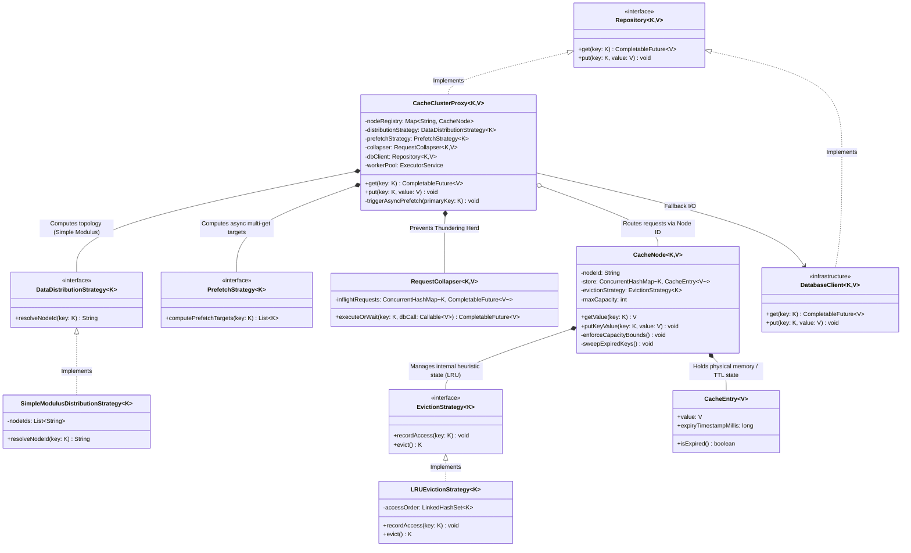

```mermaid
classDiagram
    class Repository~K,V~ {
        <<interface>>
        +get(key: K) CompletableFuture~V~
        +put(key: K, value: V) void
    }

    class DataDistributionStrategy~K~ {
        <<interface>>
        +resolveNodeId(key: K) String
    }

    class SimpleModulusDistributionStrategy~K~ {
        -nodeIds: List~String~
        +resolveNodeId(key: K) String
    }

    class EvictionStrategy~K~ {
        <<interface>>
        +recordAccess(key: K) void
        +evict() K
    }

    class LRUEvictionStrategy~K~ {
        -accessOrder: LinkedHashSet~K~
        +recordAccess(key: K) void
        +evict() K
    }

    class PrefetchStrategy~K~ {
        <<interface>>
        +computePrefetchTargets(key: K) List~K~
    }

    class CacheClusterProxy~K,V~ {
        -nodeRegistry: Map~String, CacheNode~
        -distributionStrategy: DataDistributionStrategy~K~
        -prefetchStrategy: PrefetchStrategy~K~
        -collapser: RequestCollapser~K,V~
        -dbClient: Repository~K,V~
        -workerPool: ExecutorService
        +get(key: K) CompletableFuture~V~
        +put(key: K, value: V) void
        -triggerAsyncPrefetch(primaryKey: K) void
    }

    class CacheNode~K,V~ {
        -nodeId: String
        -store: ConcurrentHashMap~K, CacheEntry~V~~
        -evictionStrategy: EvictionStrategy~K~
        -maxCapacity: int
        +getValue(key: K) V
        +putKeyValue(key: K, value: V) void
        -enforceCapacityBounds() void
        -sweepExpiredKeys() void
    }

    class CacheEntry~V~ {
        +value: V
        +expiryTimestampMillis: long
        +isExpired() boolean
    }

    class RequestCollapser~K,V~ {
        -inflightRequests: ConcurrentHashMap~K, CompletableFuture~V~~
        +executeOrWait(key: K, dbCall: Callable~V~) CompletableFuture~V~
    }

    class DatabaseClient~K,V~ {
        <<infrastructure>>
        +get(key: K) CompletableFuture~V~
        +put(key: K, value: V) void
    }

    %% Relationships and Implementations
    Repository <|.. CacheClusterProxy : Implements
    Repository <|.. DatabaseClient : Implements
    DataDistributionStrategy <|.. SimpleModulusDistributionStrategy : Implements
    EvictionStrategy <|.. LRUEvictionStrategy : Implements

    CacheClusterProxy *-- DataDistributionStrategy : Computes topology (Simple Modulus)
    CacheClusterProxy *-- PrefetchStrategy : Computes async multi-get targets
    CacheClusterProxy *-- RequestCollapser : Prevents Thundering Herd
    CacheClusterProxy o-- CacheNode : Routes requests via Node ID
    CacheClusterProxy --> DatabaseClient : Fallback I/O

    CacheNode *-- EvictionStrategy : Manages internal heuristic state (LRU)
    CacheNode *-- CacheEntry : Holds physical memory / TTL state
```
