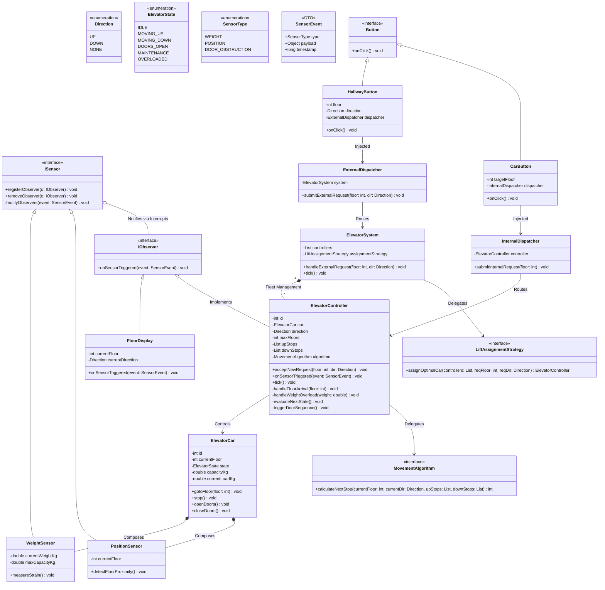

```mermaid
classDiagram
    %% Enums
    class Direction {
        <<enumeration>>
        UP
        DOWN
        NONE
    }

    class ElevatorState {
        <<enumeration>>
        IDLE
        MOVING_UP
        MOVING_DOWN
        DOORS_OPEN
        MAINTENANCE
        OVERLOADED
    }

    class SensorType {
        <<enumeration>>
        WEIGHT
        POSITION
        DOOR_OBSTRUCTION
    }

    %% Telemetry & Observer Pattern (The Sensor System)
    class SensorEvent {
        <<DTO>>
        +SensorType type
        +Object payload
        +long timestamp
    }

    class IObserver {
        <<interface>>
        +onSensorTriggered(event: SensorEvent) void
    }

    class ISensor {
        <<interface>>
        +registerObserver(o: IObserver) void
        +removeObserver(o: IObserver) void
        #notifyObservers(event: SensorEvent) void
    }

    class WeightSensor {
        -double currentWeightKg
        -double maxCapacityKg
        +measureStrain() void
    }

    class PositionSensor {
        -int currentFloor
        +detectFloorProximity() void
    }

    class FloorDisplay {
        -int currentFloor
        -Direction currentDirection
        +onSensorTriggered(event: SensorEvent) void
    }

    ISensor <|-- WeightSensor
    ISensor <|-- PositionSensor
    IObserver <|-- FloorDisplay

    %% Dispatcher & Trigger Interfaces
    class Button {
        <<interface>>
        +onClick() void
    }

    class LiftAssignmentStrategy {
        <<interface>>
        +assignOptimalCar(controllers: List, reqFloor: int, reqDir: Direction) ElevatorController
    }

    class MovementAlgorithm {
        <<interface>>
        +calculateNextStop(currentFloor: int, currentDir: Direction, upStops: List, downStops: List) int
    }

    class ExternalDispatcher {
        -ElevatorSystem system
        +submitExternalRequest(floor: int, dir: Direction) void
    }

    class InternalDispatcher {
        -ElevatorController controller
        +submitInternalRequest(floor: int) void
    }

    %% Concrete UI
    class HallwayButton {
        -int floor
        -Direction direction
        -ExternalDispatcher dispatcher
        +onClick() void
    }

    class CarButton {
        -int targetFloor
        -InternalDispatcher dispatcher
        +onClick() void
    }

    Button <|-- HallwayButton
    Button <|-- CarButton

    %% Physical Model
    class ElevatorCar {
        -int id
        -int currentFloor
        -ElevatorState state
        -double capacityKg
        -double currentLoadKg
        +gotoFloor(floor: int) void
        +stop() void
        +openDoors() void
        +closeDoors() void
    }

    %% Core Logic
    class ElevatorSystem {
        -List controllers
        -LiftAssignmentStrategy assignmentStrategy
        +handleExternalRequest(floor: int, dir: Direction) void
        +tick() void
    }

    class ElevatorController {
        -int id
        -ElevatorCar car
        -Direction direction
        -int maxFloors
        -List upStops
        -List downStops
        -MovementAlgorithm algorithm
        +acceptNewRequest(floor: int, dir: Direction) void
        +onSensorTriggered(event: SensorEvent) void
        +tick() void
        -handleFloorArrival(floor: int) void
        -handleWeightOverload(weight: double) void
        -evaluateNextState() void
        -triggerDoorSequence() void
    }

    %% Relationships
    IObserver <|-- ElevatorController : Implements
    ISensor o-- IObserver : Notifies via Interrupts
    
    ElevatorCar *-- WeightSensor : Composes
    ElevatorCar *-- PositionSensor : Composes

    HallwayButton --> ExternalDispatcher : Injected
    CarButton --> InternalDispatcher : Injected
    
    ExternalDispatcher --> ElevatorSystem : Routes
    InternalDispatcher --> ElevatorController : Routes
    
    ElevatorSystem "1" *-- "*" ElevatorController : Fleet Management
    ElevatorSystem --> LiftAssignmentStrategy : Delegates
    
    ElevatorController --> ElevatorCar : Controls
    ElevatorController --> MovementAlgorithm : Delegates
```