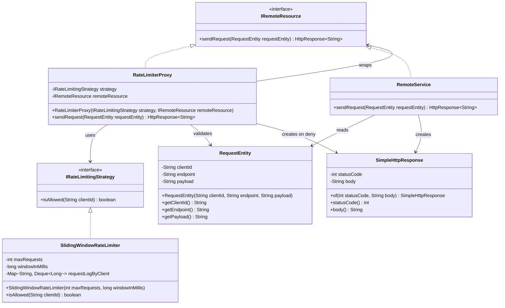
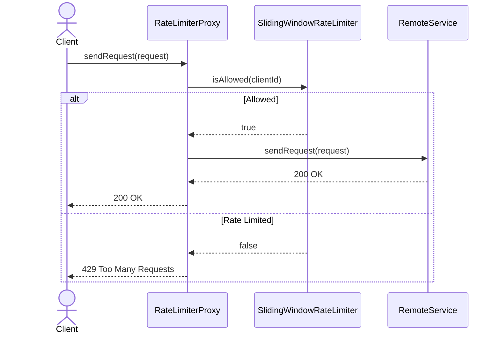

# Rate Limiter System - Mermaid Design

## Class Diagram

```mermaid
classDiagram
    class RequestEntity {
        -String clientId
        -String endpoint
        -String payload
        +RequestEntity(String clientId, String endpoint, String payload)
        +getClientId() String
        +getEndpoint() String
        +getPayload() String
    }

    class IRemoteResource {
        <<interface>>
        +sendRequest(RequestEntity requestEntity) HttpResponse~String~
    }

    class IRateLimitingStrategy {
        <<interface>>
        +isAllowed(String clientId) boolean
    }

    class SlidingWindowRateLimiter {
        -int maxRequests
        -long windowInMillis
        -Map~String, Deque~Long~~ requestLogByClient
        +SlidingWindowRateLimiter(int maxRequests, long windowInMillis)
        +isAllowed(String clientId) boolean
    }

    class RateLimiterProxy {
        -IRateLimitingStrategy strategy
        -IRemoteResource remoteResource
        +RateLimiterProxy(IRateLimitingStrategy strategy, IRemoteResource remoteResource)
        +sendRequest(RequestEntity requestEntity) HttpResponse~String~
    }

    class RemoteService {
        +sendRequest(RequestEntity requestEntity) HttpResponse~String~
    }

    class SimpleHttpResponse {
        -int statusCode
        -String body
        +of(int statusCode, String body) SimpleHttpResponse
        +statusCode() int
        +body() String
    }

    IRemoteResource <|.. RateLimiterProxy
    IRemoteResource <|.. RemoteService
    IRateLimitingStrategy <|.. SlidingWindowRateLimiter

    RateLimiterProxy --> IRateLimitingStrategy : uses
    RateLimiterProxy --> IRemoteResource : wraps
    RateLimiterProxy --> RequestEntity : validates
    RemoteService --> RequestEntity : reads
    RemoteService --> SimpleHttpResponse : creates
    RateLimiterProxy --> SimpleHttpResponse : creates on deny
```

## Sequence Diagram

```mermaid
sequenceDiagram
    actor Client
    participant Proxy as RateLimiterProxy
    participant Strategy as SlidingWindowRateLimiter
    participant Service as RemoteService

    Client->>Proxy: sendRequest(request)
    Proxy->>Strategy: isAllowed(clientId)

    alt Allowed
        Strategy-->>Proxy: true
        Proxy->>Service: sendRequest(request)
        Service-->>Proxy: 200 OK
        Proxy-->>Client: 200 OK
    else Rate Limited
        Strategy-->>Proxy: false
        Proxy-->>Client: 429 Too Many Requests
    end
```
